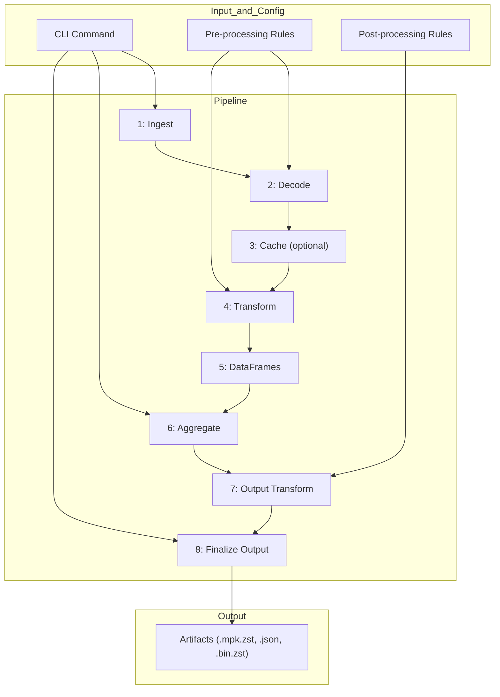

# Message Pack Processor

[](https://www.python.org/downloads/)
[](https://pytest.org)
[](https://github.com/psf/black)

A parallelized processor for ingesting, processing, and aggregating data from `.mpk` files.

This tool is designed to be robust, efficient, and extensible, using a modern Python stack including Pydantic, Polars, and Typer.

### Quick Run

`mpp-parser run -i example/i -o example/o -c example/c test_replay_id --log-level DEBUG --output-format hybrid-mpk-zst`

## Core Features

- **Schema-Driven Ingest:** All ingest/transformation rules (dequant/enum mapping) are defined in Pydantic models (`aspects_raw.py`, `aspects.py`).
- **Polars-powered**: Analytics and aggregations are performed with Polars, enabling fast analytics across large ingested datasets.
- **Plugin-friendly:** New summary statistics can be added as [simple Python plugins](docs/aggregator_guide.md#3-how-to-create-a-new-statistic-tutorial).
- **Output Transformation:** A second source of truth (`output_contracts.py`) defines how aggregated data should be transformed (e.g., quantized, cast) for downstream consumers.
- **Multiple Output Formats:** Supports various outputs: Columnar/Row-major binary formats and (msgpack, parquet, jsonl) [(see strats)](src/message_pack_parser/core/output_strategies.py)


## Basic Flow

**[▶️ Open the Output Demo](https://anovio1.github.io/message-pack-processor/example/o/binzst-consumer.html)**

## Installation

A virtual environment is highly recommended. This project uses `pyproject.toml` for dependency management.

1.  **Clone the repository:**

    ```bash
    git clone <your-repo-url>
    cd message_pack_processor
    ```

2.  **Create and activate a virtual environment:**

    ```bash
    python3 -m venv .venv
    source .venv/bin/activate
    ```

3.  **Install the package in editable mode:**
    This command installs all dependencies from `pyproject.toml` and makes the `mpp-parser` command available in your shell. The `-e` flag means changes to your source code are reflected immediately.
    ```bash
    pip install -e .
    ```

## Usage

The application is run via the `mpp-parser` command-line tool.

### Quick Run

`mpp-parser run -i example/i -o example/o -c example/c test_replay_id --log-level DEBUG --output-format hybrid-mpk-zst`

### Full Help

For a full list of all commands and options:

```bash
mpp-parser --help
```

### Basic Run

This command processes a replay, computing all available stats by default and saving the output as a gzipped MessagePack file.

````bash
# Example run
mpp-parser run my-replay-001 \
    --input-dir ./path/to/your/mpk/files \
    --cache-dir ./data/cache \
    --output-dir ./data/output \
    --output-format hybrid-mpk-zst
```

### Run the Full Pipeline
To run the processor, you need to provide a unique ID for the replay and specify the input, cache, and output directories.

```bash
# Example run
mpp-parser run my-replay-001 \
    --input-dir ./path/to/your/mpk/files \
    --cache-dir ./data/cache \
    --output-dir ./data/output
````

**Common Flags:**

- `--force-reprocess`: Ignores any existing cache and re-parses all raw files.
- `--skip-on-error`: Logs errors for individual bad records but continues processing instead of halting.
- `--dry-run`: Performs configuration validation and file ingestion, then reports what it found without processing any data.
- `--serial`: Runs in single-threaded mode. This is slower but enables caching and can simplify debugging.

### **Selecting What to Output**


You have granular control over which aggregated statistics and which raw data streams are included in the final output.

#### Computing Specific Stats

Use the `--stat` or `-s` flag to select one or more summary statistics. If you don't use this flag, a default set of stats will be computed.
```bash
# Compute only the damage breakdown stat
mpp-parser run <REPLAY_ID> ... -s damage_by_unit_def

# Compute both damage and resource stats
mpp-parser run <REPLAY_ID> ... -s damage_by_unit_def -s resources_by_team
```

#### Including Unaggregated Data Streams

Use the `--stream` or `-u` flag to select one or more raw data streams. By default, only the `command_log` is included.
```bash
# Output the default command_log AND the unit_positions stream
mpp-parser run <REPLAY_ID> ... -u unit_positions

# Output only the damage_log and unit_events streams (this will NOT include command_log)
mpp-parser run <REPLAY_ID> ... -u damage_log -u unit_events
```

---


### **Choosing an Output Format**

Select an output format suitable for your workflow using the `--output-format` flag.

#### High-Performance Binary Formats (Recommended for UI/API)

These formats are optimized for machine consumption and are ideal for powering frontend applications or downstream APIs. They produce a schema file that describes the layout of the binary data.

1.  **Hybrid Bundle (Default): `hybrid-mpk-zst`**
    This is the most flexible format. It creates a **single `.mpk.zst` file** containing a master schema and all the binary data blobs. It can contain a mix of columnar and row-major streams, as defined in `output_contracts.py`.
    ```bash
    mpp-parser run <REPLAY_ID> ... --output-format hybrid-mpk-zst
    ```

2.  **Row-Major (Streaming-Optimized): `row-major-zst`**
    This format is designed for consumers that process data row-by-row (e.g., replaying events). It creates a directory containing a `schema.json` and one compressed binary file per table. This format requires a matching contract to be defined in `output_contracts.py`.
    ```bash
    mpp-parser run <REPLAY_ID> ... --output-format row-major-zst
    ```
    
3.  **Columnar (Analytics-Optimized): `columnar-zst`**
    This format is ideal for analytical UIs (charting, data exploration). It creates a directory containing a `schema.json` and one compressed binary file per column.
    ```bash
    mpp-parser run <REPLAY_ID> ... --output-format columnar-zst
    ```

#### Standard Utility Formats

These formats are useful for general-purpose data analysis or interoperability with other tools.
```bash
# Get a directory of standard, self-describing Parquet files
mpp-parser run <REPLAY_ID> ... --output-format parquet-dir

# Get a directory of gzipped JSON Lines files
mpp-parser run <REPLAY_ID> ... --output-format jsonl-gzip
```

---

### **Listing Available Data**

Use these commands to discover what you can compute and output.

```bash
# See a list of all recognized aggregation stats
mpp-parser list-stats

# See a list of all available unaggregated data streams
mpp_parser list-streams
```

---

### Serial Mode (for Caching & Debugging)

To enable caching, you must run in serial mode.

```bash
mpp-parser run <REPLAY_ID> ... --serial
```

### List Recognized Aspects

To see which aspect files the current schemas are configured to handle:

```bash
mpp-parser list-aspects
```

## Testing

A basic but critical test is included to ensure all configurations and schemas are consistent. This can be run using `pytest`.

1.  **Install testing dependencies:**
    ```bash
    pip install pytest
    ```
2.  **Run the tests:**
    ```bash
    pytest
    ```


## Flow



## Project Structure

The project uses a standard `src`-layout for clean packaging and imports.

```
message_pack_parser/
├── pyproject.toml
├── requirements.txt
├── CHANGELOG.md
├── README.md
├── docs/
│   ├── aggregator_guide.md
│   ├── data_dictionary.md
│   └── design_document.md
├── src/
│   └── message_pack_parser/
│       ├── __init__.py
│       ├── main.py                     # CLI Entry Point & Orchestration
│       ├── logging_config.py           # Centralized Logging Setup
│       ├── config/
│       │   ├── __init__.py
│       │   ├── enums.py                # All Enum definitions
│       │   └── dynamic_config_builder.py # Builds configs from schemas
│       ├── core/
│       │   ├── __init__.py
│       │   ├── exceptions.py
│       │   ├── ingestion.py
│       │   ├── decoder.py
│       │   ├── cache_manager.py
│       │   ├── value_transformer.py
│       │   ├── dataframe_creator.py
│       │   ├── aggregator.py           # --- STAT ORCHESTRATOR ---
│       │   ├── output_transformer.py       # --- NEW: Applies output contracts ---
│       │   ├── output_generator.py
│       │   ├── output_strategies.py
│       │   └── stats/                  # --- STATS PLUGIN DIRECTORY ---
│       │       ├── __init__.py         # Dynamic registry builder
│       │       ├── types.py            # Shared types (e.g., Stat class)
│       │       ├── aggression_by_unit.py
│       │       ├── calculate_player_apm_and_focus.py
│       │       ├── combat_engagement_summary.py
│       │       ├── crisis_response_index.py
│       │       ├── damage_by_unit_def.py
│       │       ├── force_composition_timeline.py
│       │       ├── map_control_timeline.py
│       │       ├── player_collaboration.py
│       │       ├── player_economic_efficiency.py
│       │       ├── resources_by_player.py
│       ├── schemas/
│       │   ├── __init__.py
│       │   ├── aspects_raw.py              # --- Pre-processing source of truth ---
│       │   ├── output_contracts.py       # --- NEW: Post-processing source of truth ---
│       │   └── aspects.py
│       └── utils/
│           ├── __init__.py
│           └── config_validator.py
└── tests/
    ├── __init__.py
    ├── unit/
    │   ├── __init__.py
    │   └── test_aggregator.py
    ├── test_cli.py
    └── test_config_consistency.py
```
